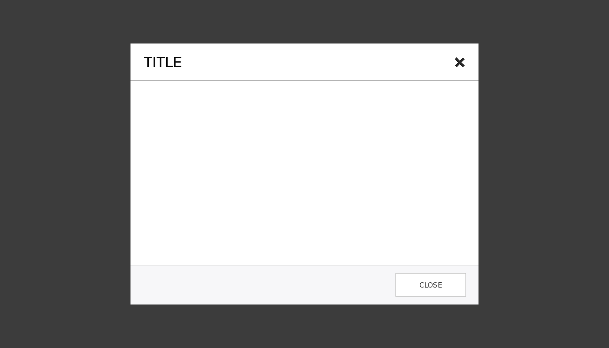

##ofxModal

A flexible and extensible kit of Modal windows for [openFrameworks](http://openframeworks.cc/).

## Installation

ofxModal is built on top of [ofxDatGui](https://github.com/braitsch/ofxDatGui) and [ofxParagraph](https://github.com/braitsch/ofxParagraph) which requires you to clone the repository recursively if you do not already have these addons installed.

	git clone --recursive git@github.com:braitsch/ofxModal.git

Once you've created a project copy the **ofxbraitsch** directory in the root of this repository to your project's bin/data directory. This directory contains the fonts & icons used by ofxModal & ofxDatGui.

## Alerts
Displaying an Alert is as simple as:

	ofxModalAlert myAlert;
	myAlert.alert("you have borked the system.");

However it's a good idea to create a single application Alert that can be shared across multiple modal windows.

	loginModal login;
	shared_ptr<ofxModalAlert> myAlert = make_shared<ofxModalAlert>();
	login.setAlert(myAlert);
	login.addListener(this, &ofApp::onLoginEvent);
	login.show();
	
	void onLoginEvent(ofxModalEvent e)
	{
		if (e.type == ofxModalEvent::CONFIRM){
		// query your custom modal for valid user data //
			if (login.hasValidUserData() == false){
				login.alert("error! invalid credentials");
			}
		}
	}
	
This will queue the Alert to show **after** your custom modal window has closed.

## Confirms
Confirm windows are similar to Alerts except that they also give you a cancel button and can be closed by clicking the modal backdrop.

	ofxModalConfirm confirm;
	confirm.addListener(this, &ofApp::onModalEvent);
	confirm.setMessage("Are you sure you really want to do this?");
	confirm.show();
	
	void onModalEvent(ofxModalEvent e)
	{
		if (e.type == ofxModalEvent::CANCEL){
			cout << "cancel button was selected" << endl;
		else if (e.type == ofxModalEvent::CONFIRM){
			cout << "confirm button was selected" << endl;
		}
	}

## Custom Modals

Custom modals extend ofxModalWindow which gives you a window with a title, space for components and a close button.

	class myCustomModal : public ofxModalWindow
	{
		...
	};

To add components simply pass an **ofxDatGui** component to the ``addComponent`` method.

	class myLoginModal : public ofxModalWindow
	{
		public:
			myLoginModal(){
				setTitle("Login");
				addComponent(new ofxDatGuiTextInput("name"));
				addComponent(new ofxDatGuiTextInput("password"));
			}
	};

The window will autosize to the fit the components you add however you can override this by explicity setting the height via ``modal->setHeight();``

## Footer Buttons

...

## API

	void show();
	void hide();
	void setWidth(int width);
	void setHeight(int height);
	void setTitle(string text);
	void setMessage(string text);
	void setMessageAlignment(ofxParagraph::Alignment align);
	void setBackdropActive(bool active); // close window if backdrop is clicked //

## Customization

[ofxModalTheme.h](https://github.com/braitsch/ofxModal/blob/master/src/themes/ofxModalTheme.h)